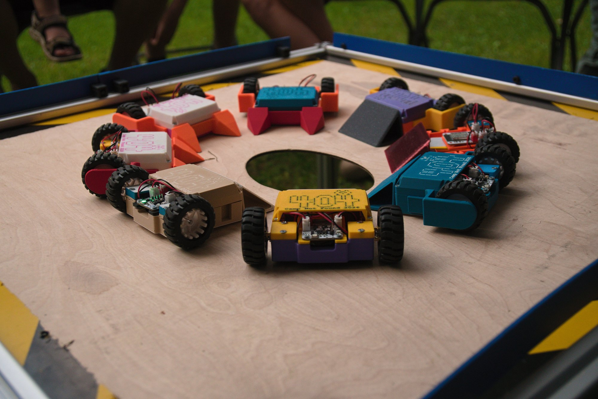
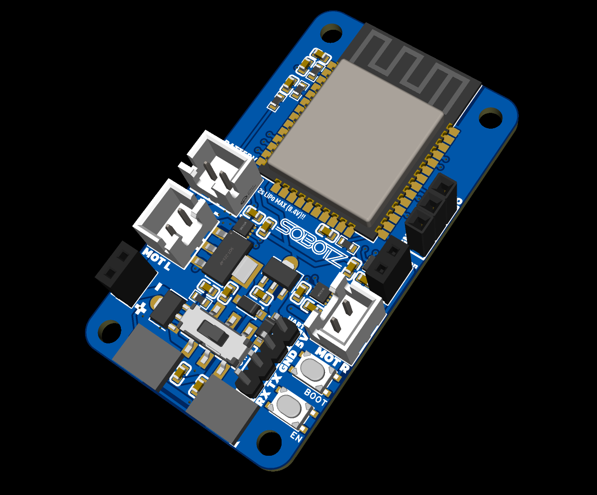
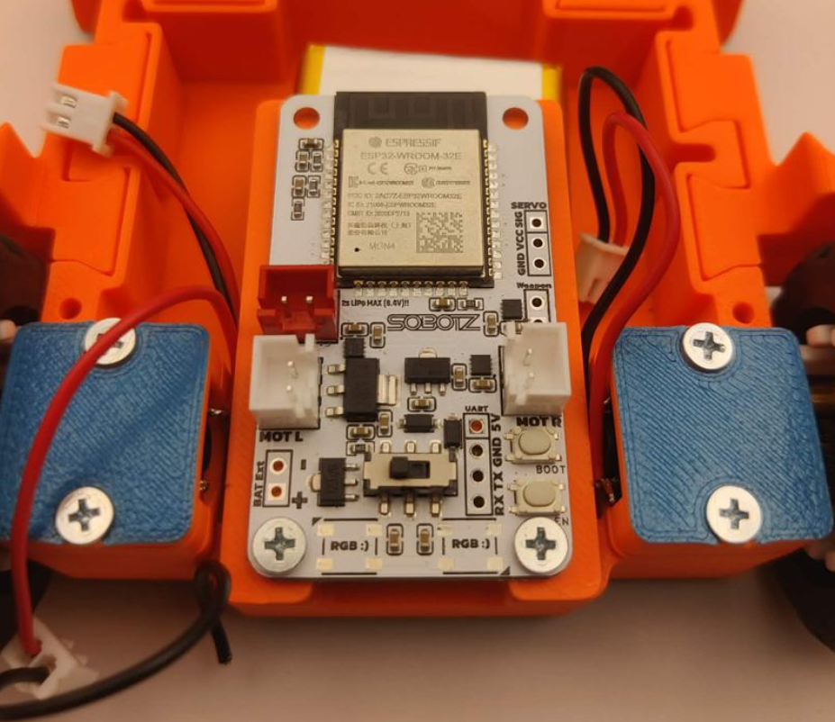
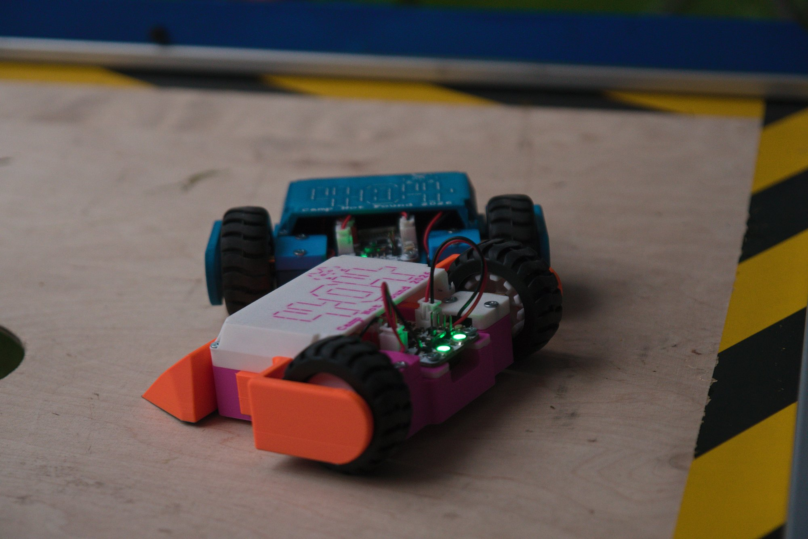

## Antweight robot workshop for NTA 2026 camp

3D printed antweight combat robot built at the Camp Not Found 2026 workshop.
Custom ESP32 mainboard, two N20 drive motors, room for a simple brushed weapon.
Driven from a gamepad, a [custom ESP32-C3 remote](software/remote), or a
[phone over Bluetooth](software/web-app-control). Robot firmware is in
[`software/robot`](software/robot).

## Mainboard

ESP32-WROOM-32E, runs straight off a 2S LiPo (8.4 V max).

- 3 brushed motor drivers - left, right, and a third one free so you can hang a simple
  brushed weapon off the robot. 1.8 A peak per channel.
- one servo output
- battery voltage monitoring
- up to 4 addressable RGB LEDs
- slide switch driving a mosfet to cut the main power

You need an assembled board to build the robot. If you're assembling your own, the gerbers are
in `hardware/pcb` along with the full EasyEDA project, which is also up at
https://oshwlab.com/gagaga1001/project_vcsypjyg

**Known issue:** servo power is wired to the LDO rail, which doesn't have enough current for
most servos. Fix that before you plug a servo in.

## Parts you need

| Part | Qty | Where |
|---|---|---|
| Assembled mainboard | 1 | gerbers + project in `hardware/pcb` |
| N20 motor, 6 V 600 rpm | 2 | [aliexpress](https://www.aliexpress.com/item/33022320164.html) |
| N20 wheels | 2 | [aliexpress](https://www.aliexpress.com/item/33026783171.html) |
| 2S LiPo battery, 1000-2000 mAh | 1 | preferably one with a balance plug |
| 2S LiPo charger | 1 | [aliexpress](https://www.aliexpress.com/item/1005004724167181.html) |
| 2-pin JST-XH leads | 3 | [aliexpress](https://www.aliexpress.com/item/1005004429625835.html) |
| Wood screws, ~3 mm | 12 | machine screws work too, wood screws just go into the print easier |
| Printed parts | 1 set | see below |

### Printed parts

All in `hardware/3d-printed-parts/`. `full-plate.3mf` has a whole robot laid out on one plate.

| File | Qty | |
|---|---|---|
| `base.3mf` | 1 | chassis |
| `side-wall-left.3mf` | 1 | |
| `side-wall-right.3mf` | 1 | |
| `motor-mount.3mf` | 2 | |
| `pcb-mount.3mf` | 1 | |
| `top-nta.3mf` / `top-plain.3mf` | 1 | pick one |
| `front-pusher.3mf` / `front-pyramids.3mf` | 1 | pick one |
| `remote-holder.3mf` | 1 | only if you build the custom remote |

## Assembly

Step by step: [docs/assembly-instructions.pdf](docs/assembly-instructions.pdf)

Short version: solder leads to the motors, screw the motor mounts down, push the wheels on
(D-shaped shaft, they only go on one way), slot in the side walls and the front you picked,
drop in the battery, screw the board onto its mount.

Motors go into the white JST connectors, the battery into the red one - **not the other way
round.**

Then flash `software/robot` and pair a controller.

